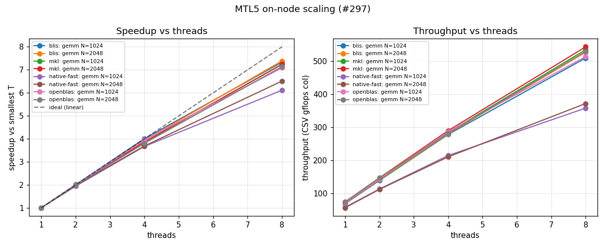
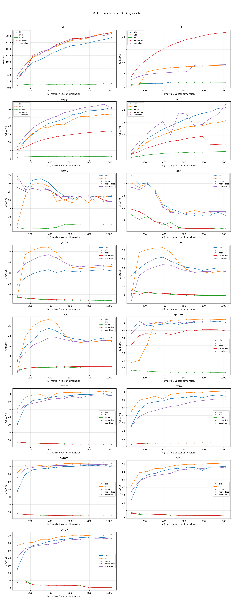
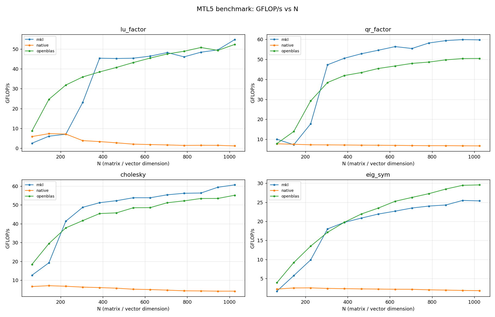

# Example benchmark data

Small, committed `bench_all` CSVs so `../plot_results.py` and the documented
GFLOP/s-vs-N curves reproduce without re-running the suite. **These are
illustrative reference numbers, not an official performance claim** — re-run on
your own hardware for anything you depend on.

## Platform

All CSVs in this directory were produced on:

| | |
|---|---|
| Run date | 2026-08-01 (all files below, one session) |
| CPU | 12th Gen Intel Core i7-12700K (hybrid: 8 P-core + 4 E-core) |
| Pinning | single thread, pinned to a P-core (`BENCH_CPU=4`); scaling runs pinned to the first T P-cores |
| OS | Ubuntu 24.04.4 LTS (Noble), kernel 6.8.0-136 |
| Compiler | GCC 13.3.0, `-O3 -DNDEBUG` (CMake `Release`) |
| OpenBLAS | 0.3.26 (`libopenblas-dev` 0.3.26+ds-1ubuntu0.1, pthreads build) |
| BLIS | 0.9.0 (`BLA_VENDOR=FLAME`) |
| Intel MKL | oneAPI 2026.1 (`BLA_VENDOR=Intel10_64lp`) |
| SuiteSparse KLU | 7.6.1 |
| SuperLU | 6.0.1 |

Full system description and the analysis of these numbers are on the
[i7-12700K result page](../../docs/benchmarks/i7-12700k.md), indexed from
[Benchmark systems](../../docs/benchmarks/systems.md). **This file describes the
data; the result page interprets it** — so a re-run updates the findings in one
place.

The sweeps are single-threaded for stable, comparable per-size numbers. Every
backend's threading control is pinned to 1 — `OMP_NUM_THREADS`,
`OPENBLAS_NUM_THREADS`, `MKL_NUM_THREADS`, `BLIS_NUM_THREADS` and
`MTL5_NUM_THREADS` — so no backend quietly uses more of the machine than
another, and the run is pinned to a performance core so the small L1 kernels
don't land on an E-core.

The `gemm_scaling_*` and `scaling_*` files are the exception: there the thread
count is the axis being measured, so the relevant variable is swept over
{1,2,4,8} while the rest stay at 1.

## Files

One file per **backend** (the build configuration *is* the backend — see
`../README.md`). Each contains exactly one backend's numbers:

| File | Backend | Build |
|------|---------|-------|
| `blas_sweep_native.csv`      | native      | generic-only (no BLAS) |
| `blas_sweep_native-fast.csv` | native-fast | `MTL5_NATIVE_FAST_GEMM + Highway + -march=native` (no BLAS) |
| `blas_sweep_blis.csv`        | blis        | `MTL5_WITH_BLAS=ON BLA_VENDOR=FLAME` |
| `blas_sweep_openblas.csv`    | openblas    | `MTL5_WITH_BLAS/LAPACK=ON` |
| `blas_sweep_mkl.csv`         | mkl         | `… BLA_VENDOR=Intel10_64lp` |
| `lapack_sweep_native.csv`    | native      | generic-only |
| `lapack_sweep_openblas.csv`  | openblas    | OpenBLAS |
| `lapack_sweep_mkl.csv`       | mkl         | MKL |
| `gemm_scaling_*.csv`         | 4 backends  | GEMM vs thread count (#108); `backend` column is `<name>-t<T>` |
| `scaling_*.csv`              | native      | #297 kernel families (gemm_rect, lu, qr, chol, ewise, sparse) |
| `klu_scoreboard.csv`         | native + KLU | native KLU vs SuiteSparse KLU (#138) |
| `superlu_scoreboard.csv`     | native + SuperLU | native LU vs SuperLU (#186) |

The `blas_*` and `lapack_*` files use the same odd-size sweep `65:1025:80` (all
odd, non-power-of-2 sizes). The `blas_*` files cover the full L1/L2/L3 core —
`dot`, `nrm2`, `axpy`, `scal`, `gemv`, `ger`, `symv`, `trmv`, `trsv`, `gemm`,
`trmm`, `trsm`, `symm`, `syrk`, `syr2k` — and the `lapack_*` files cover the
factorizations (`lu_factor`, `qr_factor`, `cholesky`, `eig_sym`).

**Every file in this directory comes from the same session**, so the backends are
directly comparable. Two absences are deliberate: BLIS has no LAPACK curve
because it is a BLAS-only library (an MTL5 build against it has no LAPACK path,
so a "blis" factorization curve would be the generic path wearing a vendor
label), and `scaling_sparse.csv` was measured at grid sides `100,160` rather than
the driver's `200,320` default, which does not complete on this machine (#321).

## Results

Tables, figures and assessments for this data — the epic #82 acceptance gate,
multi-core GEMM scaling (#108), the #297 kernel families, and the sparse
scoreboards — live on the
[i7-12700K result page](../../docs/benchmarks/i7-12700k.md).

They are deliberately not duplicated here. Numbers in two places drift: this
file previously described a passing #82 gate and a 5.82x scaling result from an
earlier session while the CSVs beside it had been replaced.

Reproduce the headline analyses directly from these files:

```bash
# Epic #82 gate: is native-fast within 20% of OpenBLAS for GEMM at N >= 256?
# Asserts the MEDIAN ratio >= 80%, plus a 70% per-size floor (#327).
../analyze_gate.py blas_sweep_native-fast.csv blas_sweep_openblas.csv \
    --gate --op gemm --threshold 0.80 --floor 0.70 --min-size 256

# Percent of a reference backend and of FMA peak (~78 GFLOP/s, 1 P-core fp64)
../analyze_gate.py blas_sweep_*.csv --peak-gflops 78

# Speedup and parallel efficiency vs thread count
../analyze_scaling.py gemm_scaling_*.csv
../analyze_scaling.py scaling_*.csv --op ewise
```



## Regenerate

The sweep CSVs (and a clean build of each variant) come from one script:

```bash
BENCH_CPU=4 BENCH_SUITES=blas ../run_sweeps.sh   # gate: native/native-fast/openblas/blis/mkl
BENCH_CPU=4 ../run_sweeps.sh                     # everything (blas + lapack)
```

The scaling and scoreboard files come from the other drivers:

```bash
BENCH_PCPUS=0,2,4,6,8,10,12,14 ../run_scaling.sh            # gemm_scaling_*.csv (#108)
BENCH_PCPUS=0,2,4,6,8,10,12,14 SPARSE_SIZES=100,160 \
    ../run_scaling_297.sh                                   # scaling_*.csv (#297)
../../build-klu/benchmarks/bench_klu         --csv klu_scoreboard.csv     klu/*/*.mtx
../../build-superlu/benchmarks/bench_superlu --csv superlu_scoreboard.csv superlu/*/*.mtx
```

`SPARSE_SIZES` is set explicitly because the driver default (`200,320`) does not
complete on this machine — see #321.

## Plots

GFLOP/s vs N, native vs OpenBLAS vs MKL, single-threaded — one curve per
backend:

```bash
../plot_results.py blas_sweep_*.csv   --out blas_sweep_gflops.png
../plot_results.py lapack_sweep_*.csv --out lapack_sweep_gflops.png
```

**BLAS L1/L2/L3** — one curve per backend, native / native-fast / BLIS /
OpenBLAS / MKL:



**LAPACK factorizations** (`lu_factor`, `qr_factor`, `cholesky`, `eig_sym`):



`native` is the generic C++ path (one curve, measured by the no-BLAS build — no
per-vendor `native` duplication). These figures are regenerated alongside the
CSVs; the same plots with written assessments are on the
[result page](../../docs/benchmarks/i7-12700k.md).
