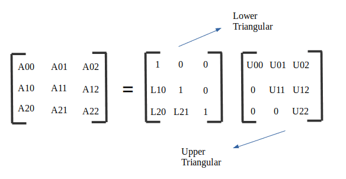

# Solving system of equations

When solving a linear system $Ax = b$, direct matrix factorizations break down a complex matrix $A$ into simpler component matrices (like triangular or orthogonal ones) that make back-substitution fast and easy.

The choice between **LU**, **QR**, and **Cholesky** comes down to three factors: matrix structure, numerical stability, and computational speed.

---

## Direct Comparison

| Feature | LU Decomposition | QR Decomposition | Cholesky Decomposition |
| --- | --- | --- | --- |
| **Factorization** | $PA = LU$ | $A = QR$ | $A = L L^T$ (or $R^T R$) |
| **Matrix Requirements** | Square, non-singular | Any $m \times n$ (great for overdetermined) | Square, **Symmetric Positive-Definite (SPD)** |
| **Flop Count** ($n \times n$) | $\sim \frac{2}{3}n^3$ | $\sim \frac{4}{3}n^3$ (Householder) | $\sim \frac{1}{3}n^3$ |
| **Speed** | Fast (general workhorse) | Moderate ($\approx 2\times$ slower than LU) | Fastest ($\approx 2\times$ faster than LU) |
| **Numerical Stability** | Good (with partial pivoting) | **Excellent** (orthogonal matrices preserve norms) | **Excellent** (inherently stable, no pivoting needed) |
| **Primary Use Case** | General square linear systems | Least-squares fitting ($m > n$) | Physical/probabilistic models with SPD matrices |

---

## 1. LU Decomposition

* **The Concept:** Factors $A$ into a Lower triangular matrix $L$ and an Upper triangular matrix $U$. In practice, partial pivoting ($P$) is used to swap rows for stability, yielding $PA = LU$.


*LU Factorization: Split into lower and upper triangular components.*

* **When to use it:** Your default choice for square systems when you know nothing special about $A$.
* **Strengths:** Fast ($\frac{2}{3}n^3$ operations). Once factored, solving $Ax = b$ for multiple different $b$ vectors takes only $O(n^2)$ time via forward and backward substitution.
* **Weaknesses:** Can fail or suffer from numerical instability if the matrix is ill-conditioned or if partial pivoting isn't applied.

---

## 2. QR Decomposition

* **The Concept:** Factors $A$ into an Orthogonal matrix $Q$ (where $Q^T Q = I$) and an Upper triangular matrix $R$.
* **When to use it:** Overdetermined systems ($m > n$, like linear regression/least squares) or when $A$ is ill-conditioned (near-singular).
* **Strengths:** Extremely stable numerically because orthogonal matrices do not amplify rounding errors. Works on rectangular matrices.
* **Weaknesses:** Costs about twice as many floating-point operations as LU ($\frac{4}{3}n^3$), making it overkill for well-behaved square systems.

---

## 3. Cholesky Decomposition

* **The Concept:** A specialized version of LU for **Symmetric Positive-Definite (SPD)** matrices (where $A = A^T$ and $x^T A x > 0$ for all non-zero $x$). It factors $A$ into $L L^T$.
* **When to use it:** Covariance matrices, finite element analysis, Gaussian processes, or network flows where symmetry and positive-definiteness are guaranteed.
* **Strengths:**
* **Twice as fast as LU** ($\frac{1}{3}n^3$ operations) and uses half the memory because $L$ and $U$ are transposes of each other.
* **Guaranteed numerical stability** without requiring row pivots.


* **Weaknesses:** Fails completely if $A$ is not positive-definite (e.g., if any eigenvalue is $\le 0$).

---

## Quick Decision Rule

1. Is $A$ **symmetric positive-definite**? $\rightarrow$ **Cholesky** (fastest, robust).
2. Is $A$ **rectangular** or **badly conditioned**? $\rightarrow$ **QR** (most stable, solves least squares).
3. Is $A$ a **standard square matrix**? $\rightarrow$ **LU** (balanced, default standard).

## Checking Symmetric Positive Definiteness

Testing if an $n \times n$ matrix $A$ is **Symmetric Positive-Definite (SPD)** requires checking two conditions:

1. **Symmetry:** $A = A^T$ (or $A_{ij} = A_{ji}$ for all $i, j$).
2. **Positive-Definiteness:** $x^T A x > 0$ for all non-zero vectors $x$.

Checking symmetry is instantaneous ($O(n^2)$ array comparisons). Checking positive-definiteness mathematically can be expensive, but there are practical ways to test it.

---

## 1. Quick Necessary Conditions (Fast Sanity Checks)

Before running an expensive check, test these fast $O(1)$ to $O(n)$ necessary conditions. If **any** of these fail, the matrix is **NOT** SPD:

* **Diagonal elements are strictly positive:** $A_{ii} > 0$ for all $i$.
* **Largest entry is on the main diagonal:** $\max\vert{}A_{ij}\vert{} = \max(A_{ii})$.
* **Trace is strictly positive:** $\text{Tr}(A) = \sum A_{ii} > 0$.

> **Note:** These are *necessary*, not *sufficient*. A matrix can pass all three and still fail to be SPD (e.g., $\begin{bmatrix} 1 & 3 \\ 3 & 1 \end{bmatrix}$ has positive diagonals, but its eigenvalues are $4$ and $-2$).

---

## 2. Practical Methods to Guarantee SPD

### Method A: Attempt Cholesky directly (The $O(n^3)$ "Try-and-Catch" Approach)

In computational practice, **the fastest way to verify if a symmetric matrix is SPD is to run Cholesky itself** with error handling:

* **Why?** Computing Cholesky takes $\frac{1}{3}n^3$ flops. Any theoretical test for positive-definiteness costs at least as much or more.
* **How it works:** Cholesky relies on square roots of diagonal pivots during elimination ($\sqrt{A_{kk} - \sum \dots}$). If a pivot becomes $\le 0$, the algorithm raises an exception or returns an error code—meaning the matrix is **not** positive-definite.

```python
import numpy as np

def is_spd(A):
    # 1. Quick symmetry check
    if not np.allclose(A, A.T):
        return False
    
    # 2. Try Cholesky decomposition
    try:
        np.linalg.cholesky(A)
        return True
    except np.linalg.LinAlgError:
        return False

```

---

### Method B: Eigenvalue Test ($O(n^3)$ but slower factor)

A matrix is SPD if and only if **all its eigenvalues are strictly positive** ($\lambda_i > 0$).

* **How to test:** Compute eigenvalues using an $O(n^3)$ solver designed for symmetric matrices (`np.linalg.eigvalsh`).
* **When to use:** Useful when analyzing small matrices or when you need to inspect the condition number ($\lambda_{\max} / \lambda_{\min}$).
* **Drawback:** Full eigenvalue decomposition is roughly 3–5$\times$ slower than Cholesky factorization.

---

### Method C: Sylvester's Criterion (Theoretical / Analytical)

A symmetric matrix is SPD if and only if all its **leading principal minors** (determinants of top-left $k \times k$ submatrices) are strictly positive:

$$\det(A_{1:1}) > 0, \quad \det(A_{1:2, 1:2}) > 0, \quad \dots, \quad \det(A) > 0$$

* **When to use:** Symbolic math (e.g., with variables in paper proofs or SymPy).
* **Drawback:** Computing multiple determinants numerically is inefficient and prone to floating-point rounding errors.

---

## Summary Comparison of Tests

| Method | Computational Cost | Best Used For |
| --- | --- | --- |
| **Diagonal Check** | $O(n)$ | Instant failure check |
| **Attempt Cholesky** | $\sim \frac{1}{3}n^3$ | **Best practical method in code** |
| **Eigenvalues ($\lambda > 0$)** | $\sim 2\text{--}4 n^3$ | Spectral analysis, condition numbers |
| **Sylvester's Criterion** | Symbolic / Variable-based | Analytical derivations / Math proofs |