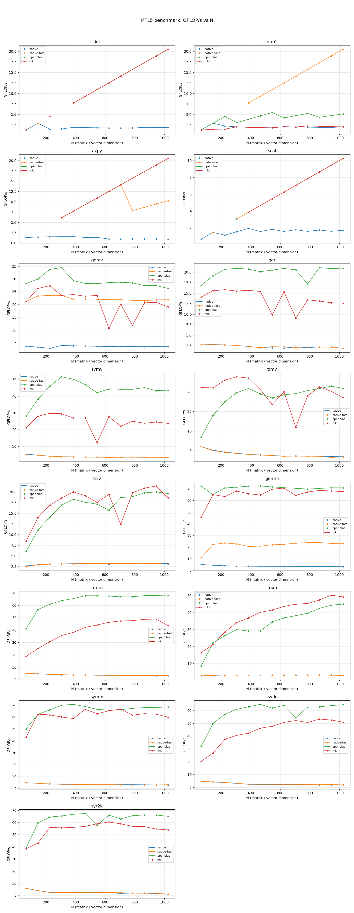
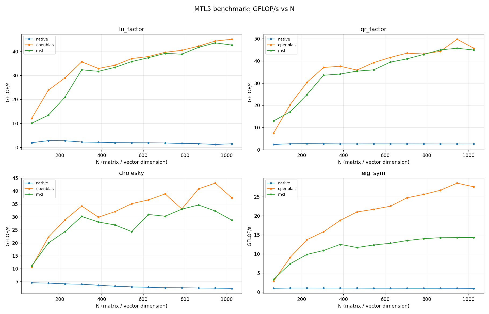
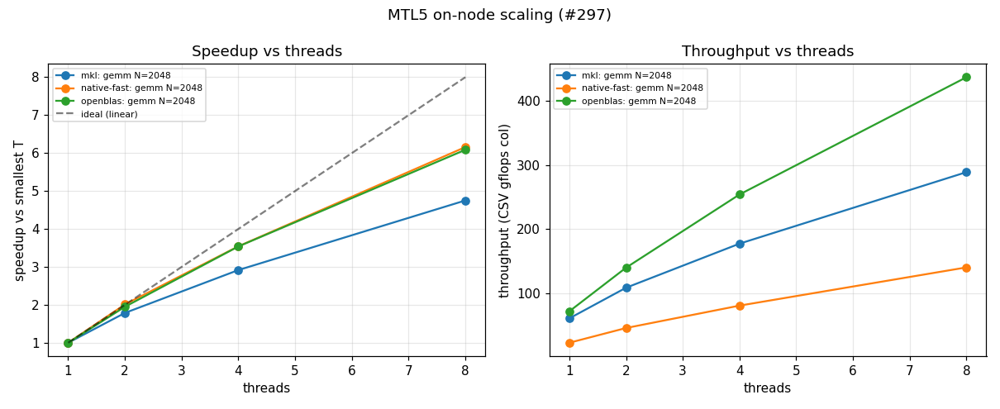
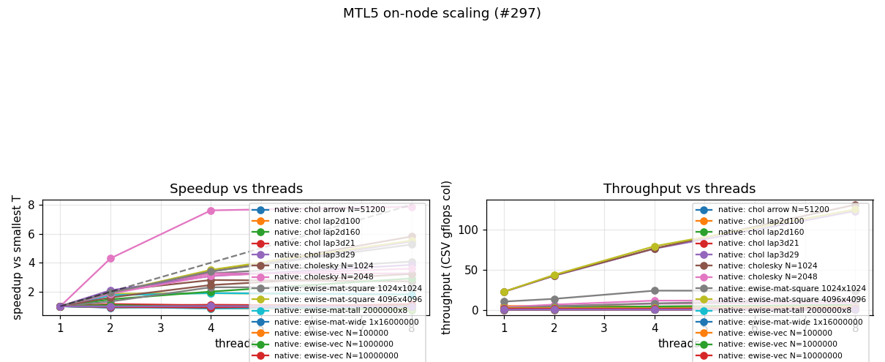

# Benchmark Results — AMD Ryzen 9 8945HS

Full benchmark results for the `ryzen-9-8945hs` system described on the
[benchmark systems](systems.md) page. Measured 2026-08-02 in a single session:
every figure below comes from the same set of builds, on the same machine,
under the pinning policy documented there.

This is the first **Windows / MSVC** results page, and the first on **AMD Zen 4**.
Read it together with the system description — and note that its backend set
differs from the [Intel i7-12700K page](i7-12700k.md) by necessity (BLIS has no
MSVC build; OpenBLAS is the official prebuilt binary, not vcpkg's generic one;
MKL comes from the `mkl-devel` wheel). These are not portable performance claims.

## Headline findings

- **The #82 GEMM acceptance gate FAILS on this machine — native-fast is at
  ~32% of OpenBLAS** (median 32.0% for N ≥ 256), far below the epic's 80% target.
  On the i7 the same gate passes at 82%. The gap is entirely in the native-fast
  kernel: OpenBLAS and MKL reach the same ~70 GFLOP/s here as on the i7, but
  MTL5's Highway blocked-GEMM delivers only ~22 GFLOP/s under MSVC on Zen 4,
  against ~59 GFLOP/s under GCC on the i7. **This is an MSVC-codegen / native
  path finding, not a hardware one** — the vendors show the silicon is fine.
- **The generic C++ path is ~7× slower than native-fast** (3.1 vs 22.8 GFLOP/s
  at N = 1025) and ~23× slower than the vendors. MSVC's autovectorizer does much
  less with the portable triple-loop than GCC `-O3` does (native is ~3 GFLOP/s
  here vs ~5 on the i7).
- **MKL pays the well-known AMD penalty.** It matches OpenBLAS on single-thread
  GEMM but loses badly on `eig_sym` (14.3 vs 27.6 GFLOP/s) and, most visibly, in
  multi-core scaling — at 8 threads OpenBLAS reaches 437 GFLOP/s to MKL's 289.
- **Native factorizations are 15–30× behind the vendors**, as on the i7 — there
  is no tuned native LAPACK path.
- **native-fast scales well** (6.16× on 8 cores, 77% efficiency) — the parallel
  decomposition is sound; it is the single-core kernel that is behind.
- **Native sparse solvers lose to SuiteSparse everywhere on MSVC** — native KLU
  wins nothing here (it beat SuiteSparse on `rajat14` under GCC), and native LU
  trails SuperLU by 2.5–23.8×. The fill ratios match the i7 exactly, so the extra
  gap is again the slower MSVC native kernel, not ordering quality.

## Dense BLAS (single-threaded)

Sweep `65:1025:80` — deliberately odd, non-power-of-2 sizes — pinned to physical
core 0 (affinity mask `0x1`), every vendor's threading forced to 1.



### GEMM, GFLOP/s

| N | native | native-fast | openblas | mkl |
|---:|---:|---:|---:|---:|
| 65 | 5.0 | 10.9 | **72.3** | 45.4 |
| 145 | 4.3 | 22.2 | 65.0 | 65.0 |
| 305 | 3.6 | 22.7 | **71.5** | 68.1 |
| 465 | 3.4 | 20.7 | **72.4** | 64.7 |
| 705 | 3.3 | 23.3 | **70.5** | 64.4 |
| 1025 | 3.1 | 22.8 | **70.9** | 67.6 |

**OpenBLAS is the fastest backend at nearly every size**, and unlike on the i7,
MKL never overtakes it — MKL's dispatch selects a less aggressive path on an
`AuthenticAMD` CPU. Both vendors sit at ~65–72 GFLOP/s, essentially the same
absolute performance as the i7's ~70–75, so the memory subsystem and cores are
delivering.

**native-fast is the story.** It flattens at ~22 GFLOP/s for N ≥ 145 — roughly
where the i7 build reaches ~56 with the identical source. The kernel is compiled
by MSVC without `-march=native` (a no-op for MSVC; the flag is GCC/Clang only),
so it leans entirely on Highway's runtime dispatch, and the result is well short
of what the same kernels achieve under GCC. The generic `native` path is worse
still, and *declining* with N as it falls out of cache — the portable fallback,
not a contender.

### Epic #82 acceptance gate — FAILING at 32.0%

The gate asks whether MTL5's own kernels land within 10–20% of OpenBLAS for GEMM
at N ≥ 256 (median ≥ 80%, per-size floor 70%). Against this session's data:

```text
benchmarks/analyze_gate.py data/ryzen-9-8945hs/blas_sweep_native-fast.csv \
    data/ryzen-9-8945hs/blas_sweep_openblas.csv --gate --op gemm \
    --threshold 0.80 --min-size 256

  median 32.0%   mean 31.6%   min 28.3%   max 34.0%   (10 sizes)

GATE FAIL: gemm vs openblas — median 32.0% < 80%; 10 sizes below the 70% floor
```

Every size is deep under the floor, with a tight 28–34% spread — this is not
run-to-run noise (which moves individual sizes by a few points), it is a
structural ~3× kernel deficit. The gate was calibrated on GCC/Linux and is met
there; it does **not** hold for the MSVC build of the native path on Zen 4. The
honest reading is that the Highway blocked-GEMM needs MSVC-specific attention
(or an `/arch:AVX2`-equivalent build path) before it is competitive on this
toolchain — the hardware clearly is, as OpenBLAS's 72 GFLOP/s on the same core
shows.

### L1 and L2

`dot` is bandwidth-bound and native-fast matches OpenBLAS exactly (~20.5 GFLOP/s,
100%). `nrm2` is a native-fast *win* — 20.5 vs OpenBLAS's 5.1 (this OpenBLAS
build has a weak `nrm2`). `axpy` reproduces the i7's outlier precisely:
native-fast holds ~50% of OpenBLAS (10.2 vs 20.5), a store-path / unrolling
limit that is consistent across the sweep and therefore structural. `gemv` is
at ~83% of OpenBLAS.

## LAPACK factorizations (single-threaded)

Same sweep and pinning. All three backends here have a LAPACK path — the official
OpenBLAS Windows binary bundles LAPACK, so unlike BLIS on the i7 page, OpenBLAS
appears in this table.



GFLOP/s at N = 1025:

| Operation | native | openblas | mkl |
|---|---:|---:|---:|
| `lu_factor` | 1.50 | **45.09** | 42.65 |
| `qr_factor` | 2.59 | **45.71** | 44.91 |
| `cholesky` | 2.40 | **37.30** | 28.71 |
| `eig_sym` | 0.97 | **27.61** | 14.31 |

Native factorizations are **15–30× behind** the vendors and the gap widens with
N — the generic algorithms have no tuned path, exactly as on the i7. `eig_sym`
is the slowest native case at under 1 GFLOP/s.

**OpenBLAS beats MKL on every factorization here**, and by ~2× on the symmetric
eigensolver (27.6 vs 14.3) and ~1.3× on Cholesky — again the AMD dispatch
penalty, now on the LAPACK side.

## Multi-core GEMM scaling

GEMM at N = 2048, threads pinned to the first T physical cores (SMT siblings
excluded, affinity masks `0x1`, `0x5`, `0x55`, `0x5555`), one process per thread
count.



| T | native-fast | openblas | mkl |
|---:|---|---|---|
| 1 | 22.8 (1.00×) | 71.8 (1.00×) | 60.8 (1.00×) |
| 2 | 45.8 (2.01×) | 139.9 (1.95×) | 108.6 (1.79×) |
| 4 | 80.7 (3.54×) | 254.1 (3.54×) | 177.4 (2.92×) |
| 8 | **140.3 (6.16×)** | 437.0 (6.09×) | 288.9 (4.75×) |

**native-fast scales the best of the three** (6.16× on 8 cores, 77% parallel
efficiency) — its parallel decomposition is healthy; the deficit is purely in
the single-core kernel, so it stays ~3× behind OpenBLAS at every thread count
rather than falling further behind.

**MKL scales the worst** (4.75×, 59% efficiency) and at 8 threads trails OpenBLAS
by 1.5× in absolute throughput (289 vs 437 GFLOP/s) — the AMD penalty compounds
with thread count. OpenBLAS is the clear multi-core leader on this part.

## Threaded kernel families (#297)

Native-fast build, `MTL5_NUM_THREADS` ∈ {1,2,4,8}, pinned to physical cores.
Dense factorizations swept at N = 1024, 2048; the sparse family at 2-D grid
sides 100, 160. (The i7 page also ran N = 4096, dropped here — the generic
native factorizations are ~3× slower under MSVC, so a 4096 T=1 baseline is
impractical.) Best and worst T=1→T=8 speedup per family:



| Family | Cases | Best | Worst |
|---|---:|---|---|
| `lu` | 2 | 3.85× (N=1024) | 3.23× (N=2048) |
| `qr` | 2 | **5.26×** (N=2048) | 3.59× (N=1024) |
| `chol` | 2 | **7.86×** (N=2048) | 2.71× (N=1024) |
| `gemm_rect` | 5 | 5.81× (2048×2048×1024) | 2.30× (64×4096×1024) |
| `ewise` | 7 | 4.08× (1024×1024) | 0.80× (vec N=100000) |
| `sparse` | 17 | 1.15× (snlu, lap2d side 100) | 0.75× (snlu, lap2d side 100) |

**Cholesky scales best at N = 2048** (7.86×, even higher than the i7's 6.24×) but
collapses to 2.71× at N = 1024 — too little work per core to amortize the
parallel decomposition, the same cliff the i7 shows. `qr` follows the same shape
(best at 2048). `lu` is the weak one here: 3.2–3.9× where the i7 reached 5.7–7.3×,
and unusually its 1024 case edges out its 2048 case.

**The flat cases are structural, not defects** — `gemm_rect` at 64×4096×1024 and
`ewise` on a long vector are single-axis shapes with no parallelism on the
partitioned dimension (`ewise` even goes *negative* at 0.80×, memory-bound), the
same row-parallel gap the i7 records.

**Sparse triangular solves do not scale in any structure** — best 1.15×, worst
0.75×, both on 2-D Laplacians. This reproduces the i7 finding (and the original
#297 result) almost exactly: level scheduling only parallelizes wide levels, and
these systems don't have them.

## Sparse direct solvers

Single-threaded, pinned to physical core 0, SuiteSparse matrices. SuperLU's
internal BLAS calls resolve against the same optimized OpenBLAS used above, so
its supernodal kernels are not handicapped. Time ratios are native ÷ external
(>1 means the vendor is faster).

### Native KLU vs SuiteSparse KLU (#138)

| Matrix | n | nnz | blocks | native (s) | KLU (s) | ratio | fill ratio |
|---|---:|---:|---:|---:|---:|---:|---:|
| `rajat14` | 180 | 1,503 | 19 | 0.001 | 0.000 | 4.1× | 1.10 |
| `add32` | 4,960 | 23,884 | 1 | 0.010 | 0.002 | 6.3× | 1.01 |
| `rajat30` | 643,994 | 6,175,377 | 11,705 | *skipped* | 9.51 | — | — |

**Unlike on the i7, native KLU wins nothing here.** On the i7/GCC build native was
3.4× *faster* than SuiteSparse on the block-triangular `rajat14` (ratio 0.29×);
under MSVC it is 4.1× *slower* on the same matrix, and 6.3× slower on the
single-block `add32` (vs 4.6× on the i7). Fill is essentially identical on both
solvers (1.01–1.10), so this is purely kernel speed — and the native kernel is
markedly slower under MSVC, the same theme as the dense native path. `rajat30`
is marked external-only; the native run is skipped.

### Native LU vs SuperLU (#186)

| Matrix | n | nnz | native (s) | SuperLU (s) | ratio | fill ratio |
|---|---:|---:|---:|---:|---:|---:|
| `add32` | 4,960 | 23,884 | 0.009 | 0.003 | 2.5× | 0.53 |
| `wang4` | 26,068 | 177,196 | 7.56 | 2.59 | 2.9× | 0.53 |
| `wang3` | 26,064 | 177,168 | 6.90 | 2.09 | 3.3× | 0.50 |
| `raefsky3` | 21,200 | 1,488,768 | 10.43 | 1.12 | 9.3× | 1.16 |
| `bbmat` | 38,744 | 1,771,722 | 133.6 | 5.61 | **23.8×** | 2.49 |

**The fill-ratio story reproduces the i7 exactly** — 0.50–0.53 on `add32`/`wang3`/
`wang4`, 1.16 on `raefsky3`, 2.49 on `bbmat` — and the two matrices where native
produces *more* fill than SuperLU (`raefsky3`, `bbmat`) are again the two worst
results by a wide margin. The mechanism holds: on dense-fill problems native
loses twice, doing more arithmetic with scalar non-supernodal kernels.

**What differs from the i7 is the baseline.** There, native *won* `add32` (0.30×,
with half the fill); here the same matrix goes to SuperLU by 2.5×, and `bbmat`
widens from 18× to 23.8×. The extra fill is identical to the i7 — the additional
gap is the slower MSVC native kernel, consistent with every other native result
on this page.

## Caveats

- **This is MSVC, not GCC.** Every difference from the i7 page that involves the
  `native` or `native-fast` path is dominated by the compiler, not the CPU. The
  vendor libraries (OpenBLAS, MKL) are the like-for-like comparison, and they
  land within a few percent of the i7's absolute GFLOP/s.
- **native-fast is not built with an explicit wide-ISA flag.** MSVC ignores
  `-march=native` (`MTL5_NATIVE_ARCH`), so the native path's own (non-Highway)
  code is compiled for the MSVC baseline, and only Highway's dispatched kernels
  target AVX2/AVX-512. This is the leading suspect for the #82 gate failure.
- **Clocks are not pinned.** Windows runs its balanced power plan; the 8945HS is
  a 35–54 W mobile part that boosts to ~5.2 GHz but sustains lower under load.
  Treat differences under ~5 points between two sizes or two runs as noise.
- **Absolute GFLOP/s depend on the measurement protocol.** Every table here comes
  from warm sweeps; short single-size runs report lower numbers. Do not compare
  these against figures taken another way.
- **MKL is the `mkl-devel` wheel (2026.1), linked via `mkl_rt`.** It is the same
  library and version the i7 page used; only the packaging differs.

## Reproducing

Builds and sweeps use the Windows PowerShell harnesses (the MSVC equivalents of
the bash scripts), which pin with processor-affinity bitmasks:

```powershell
$env:VCPKG_ROOT = "C:\path\to\vcpkg"
benchmarks\run_sweeps.ps1  -Variants native,native-fast,openblas,mkl -Suites blas   -Sweep 65:1025:80 -OutDir benchmarks\data\ryzen-9-8945hs
benchmarks\run_sweeps.ps1  -Variants native,openblas,mkl             -Suites lapack -Sweep 65:1025:80 -OutDir benchmarks\data\ryzen-9-8945hs
benchmarks\run_scaling.ps1 -Variants native-fast,openblas,mkl -Threads 1,2,4,8 -Sizes 2048 -OutDir benchmarks\data\ryzen-9-8945hs
```

The CSVs backing every table are committed under
`benchmarks/data/ryzen-9-8945hs/`, each with a `.sysinfo` companion recording the
machine identity (self-reported by `mtl::util::identify()`). Figures are
regenerated with:

```bash
benchmarks/plot_results.py   benchmarks/data/ryzen-9-8945hs/blas_sweep_*.csv   --out docs/img/benchmarks/amd-ryzen-9-8945hs/blas-sweep-gflops.png
benchmarks/plot_results.py   benchmarks/data/ryzen-9-8945hs/lapack_sweep_*.csv --out docs/img/benchmarks/amd-ryzen-9-8945hs/lapack-sweep-gflops.png
benchmarks/analyze_scaling.py benchmarks/data/ryzen-9-8945hs/gemm_scaling_*.csv --plot docs/img/benchmarks/amd-ryzen-9-8945hs/gemm-scaling.png
```

The #297 threaded kernel-family sweep (native-fast, one CSV per family):

```powershell
benchmarks\run_scaling_297.ps1 -Threads 1,2,4,8 -LapackSizes 1024,2048 -SparseSizes 100,160 -OutDir benchmarks\data\ryzen-9-8945hs
```
```bash
benchmarks/analyze_scaling.py benchmarks/data/ryzen-9-8945hs/scaling_*.csv --plot docs/img/benchmarks/amd-ryzen-9-8945hs/kernel-scaling-297.png
```

The sparse scoreboards use `bench_klu` / `bench_superlu` (built with the vcpkg
toolchain + `-DMTL5_WITH_SUITESPARSE_KLU=ON -DMTL5_WITH_SUPERLU=ON`, plus a BLAS
for SuperLU's internal kernels), run against the SuiteSparse matrices fetched by
`benchmarks/fetch_klu_matrices.sh` / `fetch_superlu_matrices.sh`:

```powershell
bench_klu.exe     --csv benchmarks\data\ryzen-9-8945hs\klu_scoreboard.csv     data\klu\rajat14\rajat14.mtx data\klu\add32\add32.mtx ext:data\klu\rajat30\rajat30.mtx
bench_superlu.exe --csv benchmarks\data\ryzen-9-8945hs\superlu_scoreboard.csv data\superlu\add32\add32.mtx data\superlu\wang4\wang4.mtx data\superlu\wang3\wang3.mtx data\superlu\raefsky3\raefsky3.mtx data\superlu\bbmat\bbmat.mtx
```
