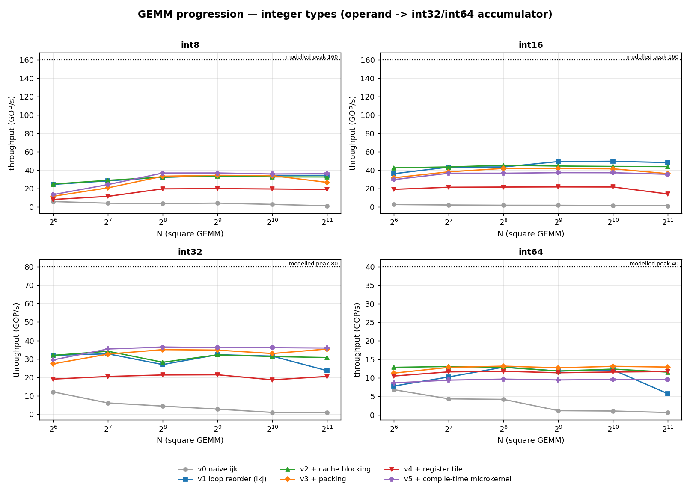
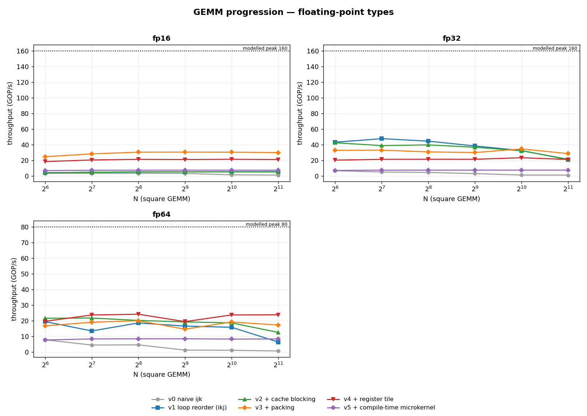
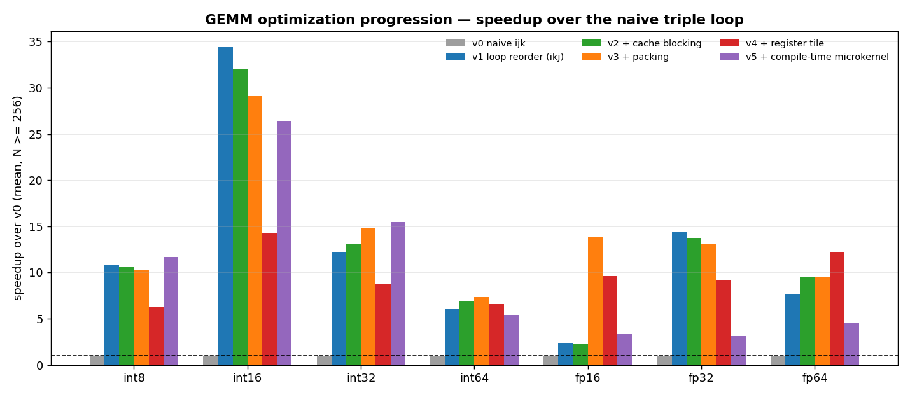

# PPE Results — GEMM optimization progression

Six kernels × seven operand types × six matrix sizes, single core, pinned to a
P-core. **252 measurements, all verified against the naive reference, none
exceeding the peak model.**

Machine: Intel i7-12700K, AVX2 + FMA + AVX-VNNI, no AVX-512. GCC 13.3,
`-O3 -march=native`. Peak is the model in `include/ppe/peak.hpp` at 5.0 GHz.

## The headline: there is no single best kernel

| type | peak | v0 | v1 | v2 | v3 | v4 | v5 | best | vs v0 |
|---|---:|---:|---:|---:|---:|---:|---:|---:|---:|
| int8 | 160 | 1.4 | 34.5 | 32.8 | 26.9 | 19.2 | **36.4** | v5 | 26× |
| int16 | 160 | 1.0 | **48.1** | 43.8 | 36.0 | 13.9 | 35.4 | v1 | 48× |
| int32 | 80 | 1.0 | 23.6 | 30.7 | 35.4 | 20.5 | **35.9** | v5 | 37× |
| int64 | 40 | 0.6 | 5.7 | 11.5 | **12.9** | 11.7 | 9.6 | v3 | 20× |
| fp16 | 160 | 1.0 | 5.4 | 5.0 | **29.9** | 20.9 | 7.3 | v3 | 30× |
| fp32 | 160 | 1.0 | 20.8 | 21.3 | **28.6** | 21.0 | 7.3 | v3 | 28× |
| fp64 | 80 | 0.6 | 6.3 | 12.5 | 17.2 | **23.8** | 8.3 | v4 | 37× |

GOP/s at N=2048. **Four different kernels win across seven types.** The tidy
story where each step improves on the last does not survive contact with the
measurement — which is the most useful thing this study produces.







## What each step actually bought

**v0 → v1 (loop reorder) is the single biggest step**, 20–48× depending on type,
and it costs one line. Everything downstream is a refinement on a change that
merely made the inner loop walk memory forwards. Any performance work that skips
this and starts with blocking is optimizing the wrong thing.

**v1 → v2 (cache blocking) is small or negative** — `int16` *loses* 9%, `int32`
gains 30%. At these sizes on this machine, `v1` already gets enough reuse from
the hardware that explicit tiling mostly adds index arithmetic. Blocking pays
where the type's working set is large relative to cache: it helps `int32`,
`int64` and `fp64`, and hurts the narrow types.

**v2 → v3 (packing) is where the float types come alive** — `fp16` jumps 5.0 →
29.9 and `fp32` 21.3 → 28.6 — and where the narrow integers regress. That split
is explained by a known confound: **`v3` packs into the accumulator type**, so
`int8 → int32` inflates the packed buffer 4×, paying a copy cost proportional to
the widening. See the experiment proposed in
[03](03-blocking-packing.md#the-honest-caveat).

**v3 → v4 (register tiling) helps only fp64** (17.2 → 23.8) and hurts everything
else, sometimes badly (`int16` 36.0 → 13.9). The microtile keeps accumulators in
locals but with runtime bounds, and for types where the vectorizer was already
doing well, the restructuring gets in its way.

**v4 → v5 (compile-time microkernel) is the cliff.** Best for `int8`/`int32`,
catastrophic for the floats. Covered below.

## Nothing gets close to peak

The best kernel per type reaches only:

| type | best | efficiency |
|---|---|---:|
| int32 | v5 | **44.9%** |
| int64 | v3 | 32.2% |
| int16 | v1 | 30.1% |
| fp64 | v4 | 29.7% |
| int8 | v5 | 22.7% |
| fp16 | v3 | 18.7% |
| fp32 | v3 | **17.9%** |

That is expected — none of these kernels uses explicit SIMD intrinsics, software
prefetch, or a hand-scheduled microkernel, which is what the remaining 55–82%
buys in a tuned BLAS. For calibration, MTL5's own tuned kernel reaches ~72–78% of
peak for fp64 on this machine, and OpenBLAS ~90%.

The interesting number is not the absolute efficiency but the **spread**: `fp32`
sits at 17.9% while `int32` reaches 44.9%, against a modelled peak twice as high.
The floats have far more headroom left, precisely because they have more to gain
from vectorization that these kernels do not exploit.

## The vectorization cliff, and what it turned out to be

`v5` — compile-time `MR`/`NR`, no edge tests, fully unrollable, which is what
every tutorial does next — is the **slowest** kernel for `fp32` (7.3 vs `v3`'s
28.6) and the **fastest** for `int8` and `int32`.

The compiler explains it:

```
missed: not vectorized: loop nest containing two or more
        consecutive inner loops cannot be vectorized
stack usage:  v4_regtile 832 B  ->  v5_micro 1344 B
```

and checking per type shows `v5` **never vectorizes, for any of them**. So the
mechanism is not register pressure, as first supposed:

> The compile-time-unrolled microkernel is always scalar, and the penalty for
> being scalar is proportional to how much that type gains from vectorization.

`fp32`/`fp64` gain 4–8× from SIMD, so losing it is fatal. `int32` is
throughput-limited by `vpmulld` rather than lane-limited, so a scalar kernel is
competitive and `v5`'s tighter scheduling wins on the margin.

**Full unrolling removed the loop structure the vectorizer needed.** Source-level
"optimization" silently traded away the largest win in the progression.

## Open hypotheses

Carried forward with the experiment that would settle each. H2 first — it is a
one-line change and it separates "tile too big" from "unrolling destroyed
vectorization".

| # | hypothesis | experiment | status |
|---|---|---|---|
| H2 | The failure is unrolling, not tile size | keep 4×8, force `jj` to remain a loop | **run first** |
| H1 | The tile is too large for the register file | sweep `MR × NR` ∈ {4×4, 4×8, 6×8, 8×8} | reframed by the type-dependence — no longer first-order |
| H3 | It is a GCC-specific decision | rebuild with Clang 18, compare | open |
| H4 | Explicit SIMD types remove the guesswork | reimplement `micro` with a vector type | open |
| H5 | Narrow types fail differently | compare int8/int16 against the floats | **answered** — the cliff is type-dependent, tracking SIMD headroom |
| H6 | `v3`'s narrow-type regression is the widening pack | pack in operand type, widen in the microkernel | open, from [03](03-blocking-packing.md) |

## Feeding back into MTL5

MTL5's GEMM derives its register tile as `area = nvec × fma_latency × fma_units`
= 32, giving `mr × nr = 4 × 8` — the same shape as `v5`, and exactly the minimum
accumulator count with no headroom. The library sustains ~72–78% of peak
single-core ([mtl5#351](https://github.com/stillwater-sc/mtl5/issues/351)).

This study does not show that shape is wrong — MTL5 *does* vectorize its
microkernel, so it is not on the cliff. What it shows is that **the margin
between "vectorized with a minimal tile" and "unrolled into scalars" is one
compiler decision wide**, and that a tile derived at exactly the saturation
minimum has no slack if that decision goes the other way. H2 and H1 here are the
cheap way to explore that space before touching the library.

## Reproducing

```bash
cd ppe && cmake -B build -DCMAKE_BUILD_TYPE=Release && cmake --build build -j4
taskset -c 4 ./build/ppe_gemm --sizes 64,128,256,512,1024,2048 --ghz 5.0 --csv data/ppe_gemm.csv
./analyze/plot_ppe.py data/ppe_gemm.csv --outdir data
```

Numbers here are from a quiet machine, pinned to CPU 4. Run-to-run variation of a
few percent is normal; differences under ~5% should not be read as signal.
